# User Flows & System Diagrams
## Personal Bento-Style Link Website

**Version:** 1.0  
**Date:** 2026-07-24

---

## 1. User Flow Diagram

### 1.1 Visitor Journey (Primary Flow)

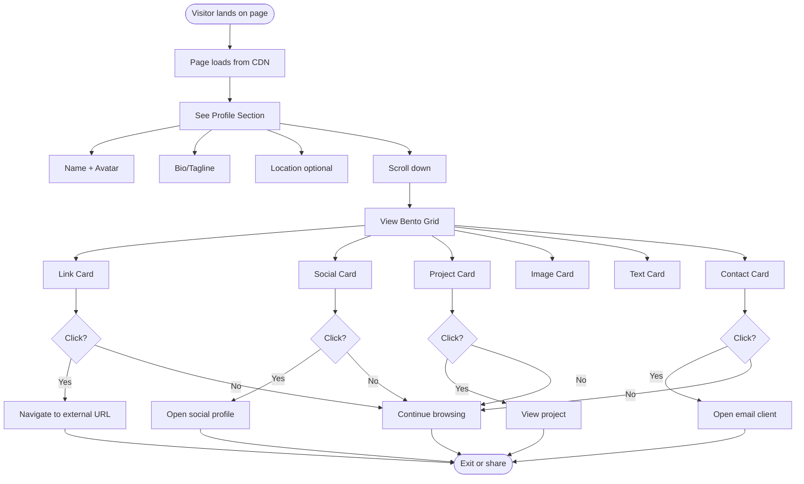

### 1.2 Content Owner Journey (Update Flow)

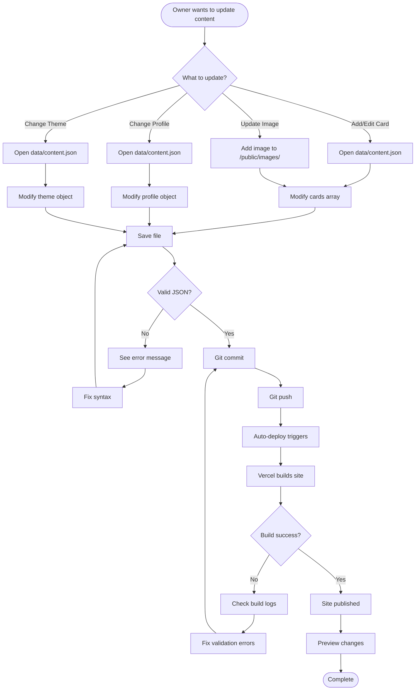

---

## 2. System Architecture Diagram

### 2.1 High-Level System Overview

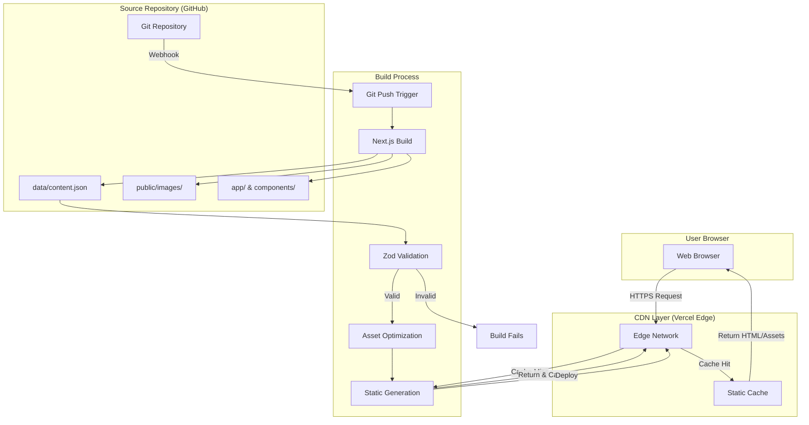

### 2.2 Component Architecture

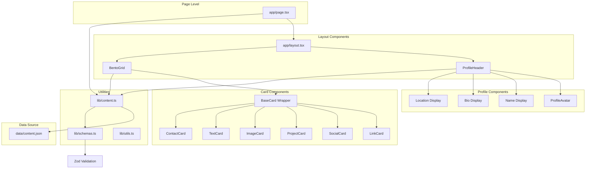

---

## 3. Data Flow Diagrams

### 3.1 Build-Time Data Flow

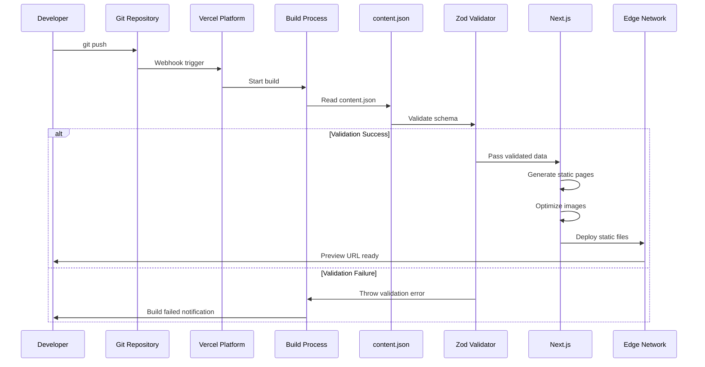

### 3.2 Runtime Data Flow (Client-Side)

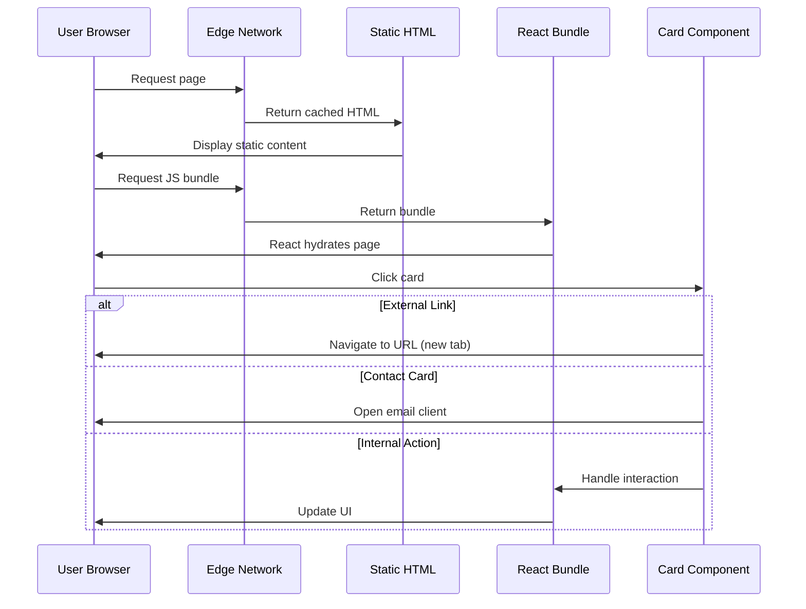

---

## 4. Content Update Flow

### 4.1 Quick Update Process

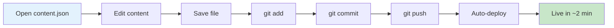

### 4.2 Content Validation Flow

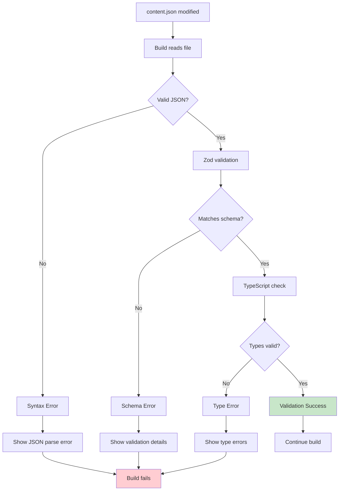

---

## 5. Card Rendering Flow

### 5.1 Card Component Decision Tree

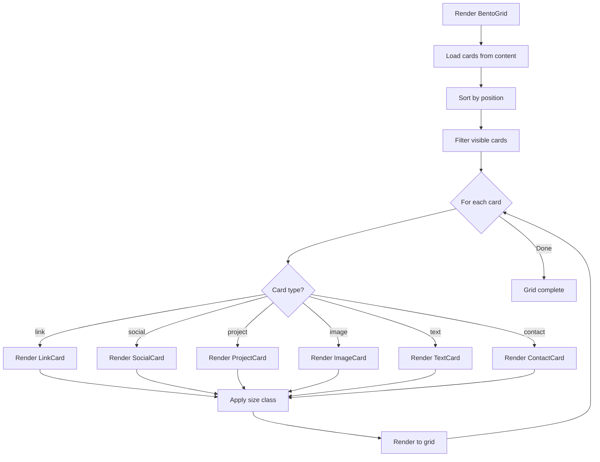

### 5.2 Card Size Responsive Mapping

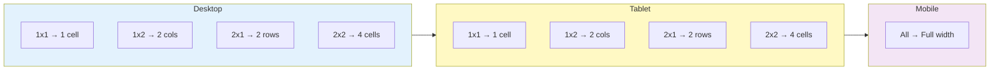

---

## 6. Responsive Layout States

### 6.1 Grid Breakpoint Flow

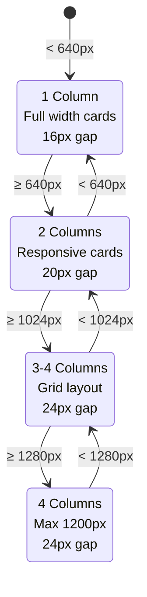

---

## 7. Image Optimization Flow

### 7.1 Next.js Image Pipeline

```mermaid
flowchart TD
    Start[Image in content.json] --> Check{Local or URL?}
    
    Check -->|Local path| Local[/public/images/file.jpg]
    Check -->|External URL| External[https://...image.jpg]
    
    Local --> NextImage[Next.js Image Component]
    External --> NextImage
    
    NextImage --> Format{Request format?}
    
    Format --> WebP[WebP supported?]
    WebP -->|Yes| ServeWebP[Serve WebP]
    WebP -->|No| AVIF[AVIF supported?]
    
    AVIF -->|Yes| ServeAVIF[Serve AVIF]
    AVIF -->|No| Original[Serve original]
    
    ServeWebP --> Resize[Responsive sizes]
    ServeAVIF --> Resize
    Original --> Resize
    
    Resize --> Optimize[Quality optimization]
    Optimize --> Cache[CDN cache]
    Cache --> Deliver[Deliver to browser]
```

---

## 8. Error Handling Flow

### 8.1 Build-Time Error Flow

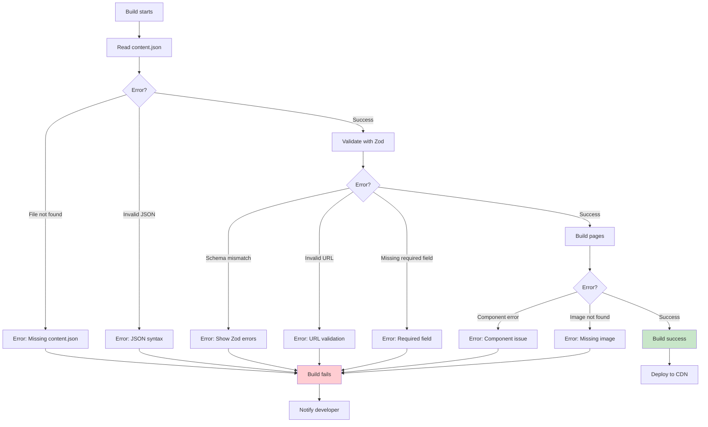

---

## 9. Analytics & Tracking Flow (Optional)

### 9.1 Card Click Tracking

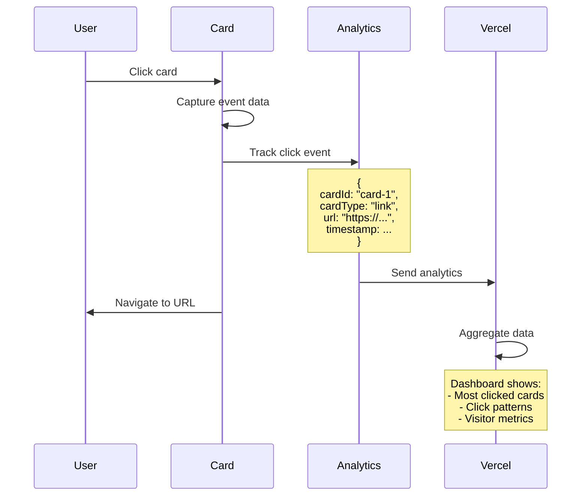

---

## 10. Deployment Pipeline

### 10.1 CI/CD Flow

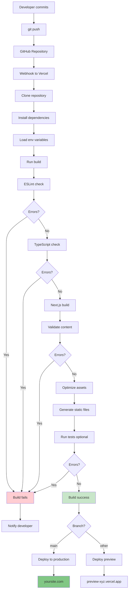

---

## 11. Theme Customization Flow

### 11.1 Theme Application Process

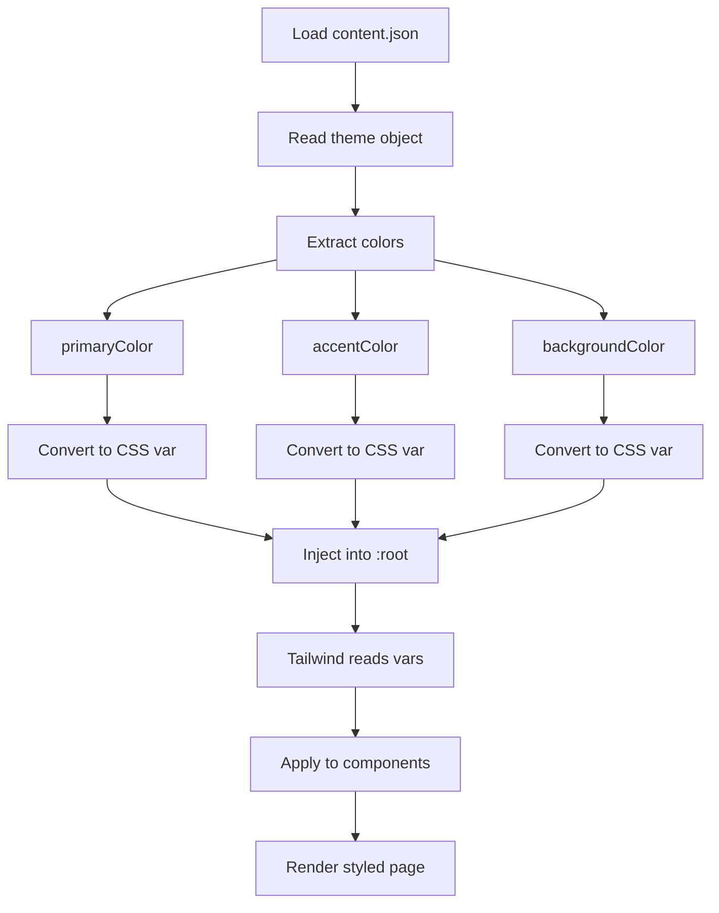

---

## 12. State Diagram: Card Interaction

### 12.1 Card States

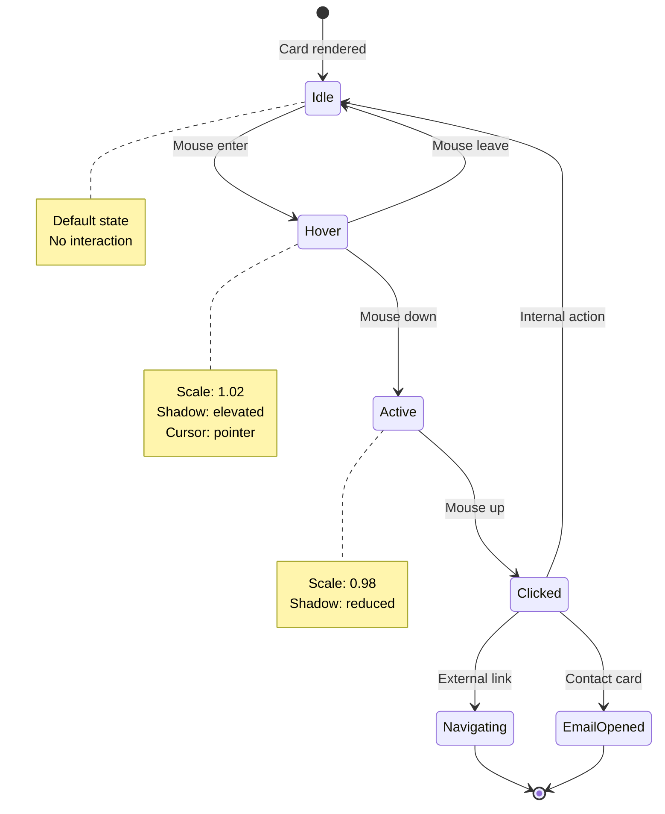

---

## 13. Content Schema Evolution

### 13.1 Version Migration Flow (Future)

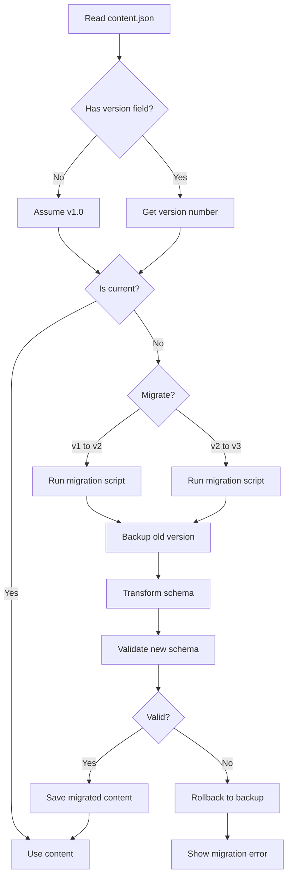

---

## Summary

This document provides visual representations of:

1. **User flows** - How visitors and content owners interact with the site
2. **System architecture** - How components are organized and connected
3. **Data flows** - How data moves through the system
4. **Build process** - How content becomes a live website
5. **Error handling** - How errors are caught and reported
6. **Deployment pipeline** - How changes go live
7. **Responsive behavior** - How layout adapts to screen sizes
8. **Card rendering** - How different card types are displayed

These diagrams use Mermaid syntax and can be rendered in:
- GitHub (native Mermaid support)
- VS Code (with Mermaid extension)
- Markdown preview tools
- Documentation sites

Use these diagrams as reference when:
- Implementing new features
- Debugging issues
- Onboarding new developers
- Explaining system architecture
